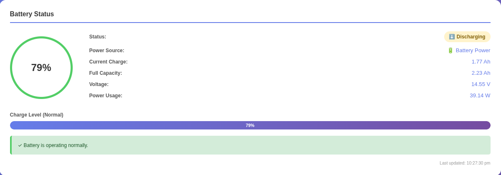
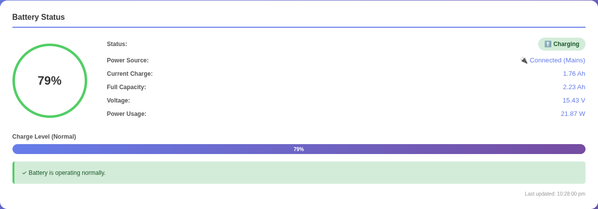
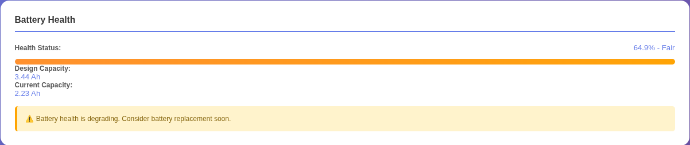
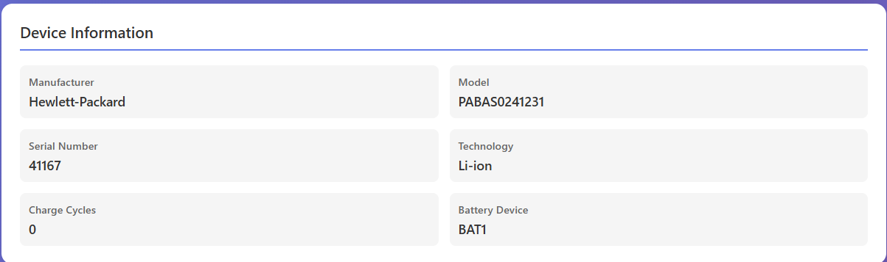

# Cockpit Battery Stats

A beautiful and feature-rich Cockpit module that displays comprehensive battery statistics for laptops running Ubuntu Server with Cockpit.

## Features

✨ **Real-time Battery & Power Monitoring**
- Live battery percentage with color-coded circular progress
- Current charge status (Charging/Discharging/Full) & Power Source detection (AC Plugged / Battery)
- Real-time voltage, current, and wattage power draw
- **Battery Temperature Monitoring (°C)** with thermal overheating warnings

🔋 **Battery Health & Energy Analysis**
- Overall battery health percentage
- Automatic unit fallback (supports both **Ah** and **Wh** Watt-hour sysfs drivers)
- Design vs. current capacity comparison
- Health degradation warnings & battery wear assessment

🛡️ **Battery Protection & Thresholds**
- Automatic detection of hardware battery protection thresholds (e.g. 80% charge limits on ThinkPad, ASUS, Dell, Lenovo)

⏱️ **Time Estimates**
- Estimated time until battery depletion (when discharging)
- Estimated time to full charge (when charging)

📊 **Windows 11-Style Interactive Battery Levels Graph (Optional)**
- **Interactive Bar Chart**: Visualizes battery levels over time with rounded color-coded bars and ⚡ charging badges.
- **Timeframe Selector**: Toggle views between **Last 12 Hours** and **Last 24 Hours**.
- **Hover Tooltips**: Floating glassmorphism popup displaying exact Time, Battery %, Status, Wattage draw, and Temperature.
- **48-Hour Persistent Backup**: Optional background logger (`cockpit-battery-logger.timer`) keeps up to 192 entries (48 hours of background history).
- **Clean & Optional**: If opted out during installation, the Battery History section is automatically removed from the webpage for a clean, minimal dashboard!

⚠️ **Smart Alerts**
- Low battery critical warnings
- Thermal / high temperature warnings (>45 °C)
- Battery degradation alerts
- Health status notifications

📱 **Beautiful Dashboard & Web Controls**
- Modern purple gradient UI
- Responsive layout (desktop & mobile)
- Hoverable info tooltip ℹ️ next to **Battery Device** displaying full sysfs path (e.g. `/sys/class/power_supply/BAT1`)

🔧 **Device Information**
- Auto-detection of battery sysfs path (`BAT0`, `BAT1`, etc.)
- Manufacturer and model details
- Serial number
- Battery technology type (Li-ion, etc.)
- Charge cycle count & hardware device name

## Screenshots

### Main Dashboard

The main Battery Monitor dashboard displays all battery information at a glance:



Key elements visible:
- **Battery Percentage**: Large circular indicator showing current charge percentage
- **Status Badge**: Shows current status (Full, Charging, Discharging)
- **Charge Level**: Visual progress bar showing charge percentage
- **Quick Stats**: Current charge, capacity, voltage, and power usage

- ### Battery Status Card



Displays:
- Real-time battery percentage (100%)
- Current charging status
- Current and full capacity (Ah)
- System voltage (V)
- Power consumption (W)
- Color-coded health indicator

- ### Battery Health Information



Shows:
- Battery health percentage
- Design vs. current capacity comparison
- Health degradation indicators
- Design capacity
- Current capacity
- Battery wear assessment

- ### Device Information



Details displayed:
- Manufacturer: Hewlett-Packard
- Model: PABAS0241231
- Serial Number: 41167
- Battery Technology: Li-ion
- Charge Cycles: 0
- Battery Device: BAT1

## Requirements

- Ubuntu Server (or any Linux distribution)
- Cockpit installed and running
- Laptop with battery (BAT0, BAT1, or similar)
- Root/administrative access to Cockpit

## Installation

### Quick Install

```bash
# Clone the repository
git clone https://github.com/FatVenom/cockpit-battery-monitor.git
cd cockpit-battery-monitor

# Minimal Makefile Installation (UI Dashboard only)
sudo make install

# Full Makefile Installation WITH 48-hour background history logger service
sudo make install-service
sudo systemctl daemon-reload && sudo systemctl enable --now cockpit-battery-logger.timer

# Or using the interactive installation script (prompts for optional history logger)
sudo bash install.sh
```

### Manual Install

See [INSTALL.md](INSTALL.md) for detailed installation instructions.

## Configuration

The module **automatically detects** your active battery device (`BAT0`, `BAT1`, or `Battery`) and AC power supply. No manual configuration is necessary for most systems!

If you wish to check your system's battery devices manually, run:

```bash
ls /sys/class/power_supply/
```

## Usage

1. Open Cockpit in your web browser (usually `https://localhost:9090`)
2. Log in with your credentials
3. In the sidebar under "Tools", click **"Battery Stats"**
4. View your battery information and statistics

The dashboard updates automatically every 30 seconds.

## Troubleshooting

### Blank Page

If you see a blank page:

1. **Check browser console** (F12) for errors
2. **Verify file permissions:**
   ```bash
   ls -la /usr/share/cockpit/battery-monitor/
   ```
3. **Check Cockpit logs:**
   ```bash
   sudo journalctl -u cockpit -f
   ```
4. **Restart Cockpit:**
   ```bash
   sudo systemctl restart cockpit
   ```

### Battery Device Not Found

If battery information is not showing:

1. **Check available battery devices:**
   ```bash
   ls /sys/class/power_supply/
   ```
2. **Verify battery access:**
   ```bash
   cat /sys/class/power_supply/BAT0/capacity
   ```

### Module Not Appearing in Sidebar

1. **Verify installation location:**
   ```bash
   ls /usr/share/cockpit/battery-monitor/
   ```
2. **Check manifest.json** is properly formatted
3. **Restart Cockpit** and refresh browser


## How It Works

The module uses Cockpit's `cockpit.spawn()` API to safely read battery information from `/sys/class/power_supply/` without exposing system files directly to the browser. This approach:

- ✅ Maintains security (server-side execution)
- ✅ Avoids browser sandbox restrictions
- ✅ Provides real-time data updates
- ✅ Handles missing or unavailable battery files gracefully

## Supported Systems

- Ubuntu Server 18.04+
- Debian with Cockpit
- Any Linux distribution with Cockpit and battery support
- x86_64 and ARM architectures

## Known Limitations

- Requires `/sys/class/power_supply/` to be accessible (standard on most Linux systems)
- Some laptops may not provide all battery metrics (time estimates may show as "N/A")
- Battery device naming varies by manufacturer (auto-detection handles most cases)

## Contributing

Contributions are welcome! Feel free to:

- Report bugs
- Suggest improvements
- Submit pull requests
- Improve documentation

## License

This project is licensed under the MIT License - see the [LICENSE](LICENSE) file for details.

## Author

Created with ❤️ for the Cockpit and Ubuntu community.

## Support

For issues, questions, or suggestions, please open an issue on GitHub.

## Related Projects

- [Cockpit](https://cockpit-project.org/) - The web console for Linux servers
- [Ubuntu Server](https://ubuntu.com/server) - Ubuntu's server distribution
- [Battery Management on Linux](https://wiki.archlinux.org/title/Laptop)

---

**Note:** This is a community project and is not officially affiliated with the Cockpit project.
